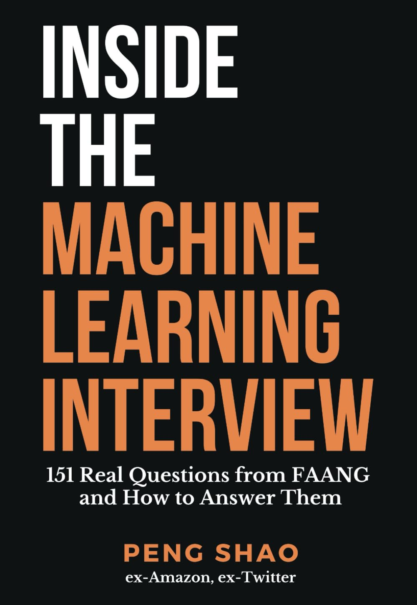

  

# Inside-The-Machine-Learning-Interview-Peng-Shao

This repo contains the publicly available papers and articles cited in the [Inside the Machine Learning Interview: 151 Real Questions from FAANG and How to Answer Them]([https://www.susannalea.com/sla-title/pressure/](https://www.amazon.ca/Inside-Machine-Learning-Interview-Questions/dp/B0C4MVRHQD)) by Peng Shao. 
**The purpose of this repo is to serve as a complimentary resource for ease of access when you're reading the book.
Please contact me know if you're one of the authors and want your papers' links removed. 
Please note that the hyperlink titles only include first author's name, title and the year published in order to make your search convenient. Please remember to cite them properly in your works. 
Please give this repo a star if you found it helpful!**

# About this book (from the back cover)

By identifying the most crucial ML topics and adopting a solid studying strategy, candidates can increase their confidence in tackling even the toughest ML interview questions. And that's where this guide comes in. Peng will walk you through the ML interview process step-by-step, presenting questions that you're likely to encounter and providing solutions that cover all the essential elements of an answer.

# Bibliography

🔹
